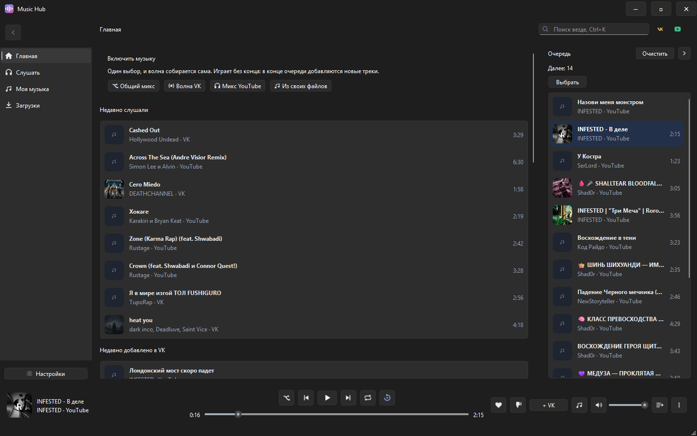
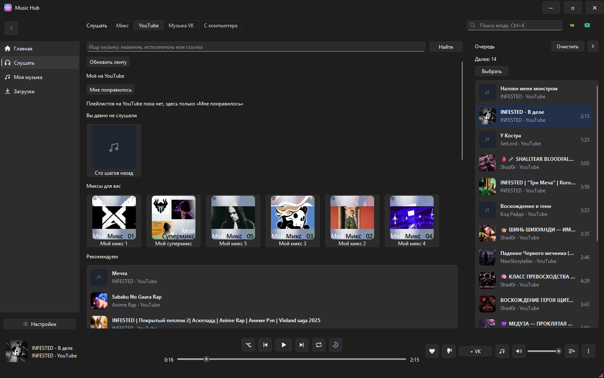
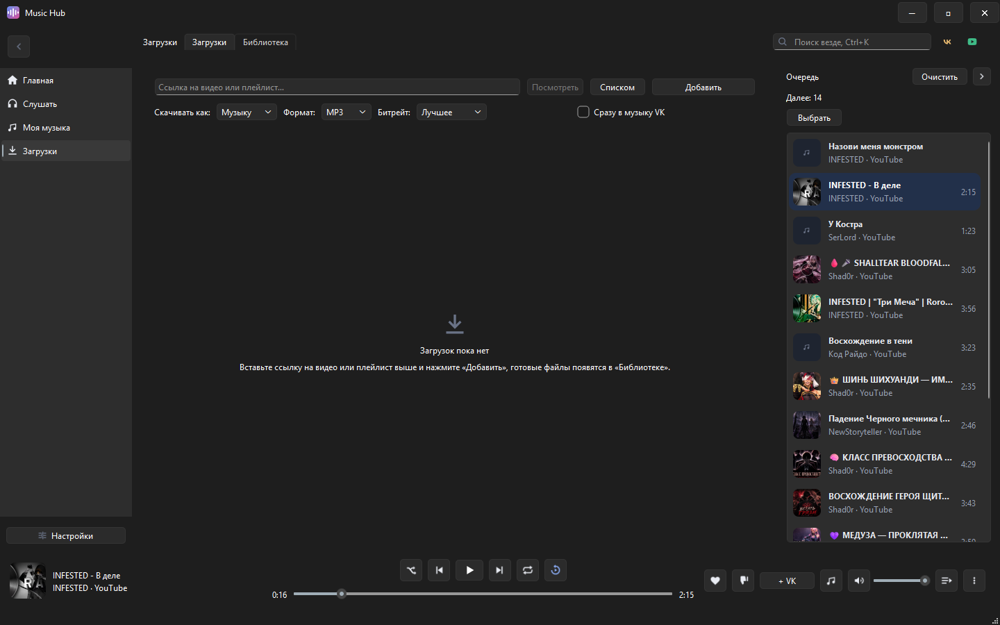

<div align="center">


# Music Hub

**Музыка из VK, YouTube и с диска - в одном окне.**

Один плеер, одна очередь, один загрузчик. Нашли трек где угодно - слушайте сразу
и одной кнопкой кладите к себе в музыку VK.

[](../../releases/latest)

[](../../releases)
[](LICENSE)
[](https://www.python.org/downloads/)


</div>



## Что это

Музыка хранится в VK, а находится - где угодно. Понравился трек на YouTube: кнопка
**«+ VK»** кладёт его в вашу музыку VK. Если такая запись в VK уже есть, приложение
добавит готовую (мгновенно), а если нет - скачает звук и зальёт файл.

Плеер сквозной: полоса управления внизу видна на любой вкладке, и музыка не обрывается
при переходе между разделами.

| | |
|---|---|
| **Слушать** | Общий микс VK и YouTube, волна без конца, свои файлы с диска |
| **Переносить** | Кнопка «+ VK» из плеера, готовая запись подхватывается мгновенно |
| **Скачивать** | MP4, MP3, M4A, Opus, FLAC; плейлисты YouTube и VK целиком |
| **Не отвлекаться** | Мини-плеер, значок в трее, горячие клавиши поверх любых окон |
| **Уносить с собой** | Переносимая папка: настройки и музыка лежат рядом с exe |

## Установка

Скачайте `MusicHub.exe` со страницы [Releases](../../releases) и запустите. Всё.

Устанавливать нечего: Python, ffmpeg и движок JavaScript уже внутри файла. Первый запуск
занимает несколько секунд - Windows распаковывает содержимое во временную папку; дальше
приложение открывается быстро.

Программа переносимая. Музыка, настройки и журналы складываются рядом с `MusicHub.exe`,
поэтому папку можно целиком унести на флешке вместе со всем нажитым.

## Как пользоваться

### Слушать



Разделы слева:

- **Главная** - что играет, недавнее, подборки и кнопки «Включить музыку»: общий микс,
  волна VK, микс YouTube или свои файлы. Одного нажатия хватает - волна собирается сама
  и играет без конца, дописывая похожее в конец очереди.
- **Слушать** - микс, YouTube, музыка VK и файлы с компьютера.
- **Моя музыка** - свои треки, плейлисты (свои, VK и YouTube) и история по дням.
- **Загрузки** - очередь скачивания и библиотека готовых файлов.

Справа - очередь проигрывания: «Играть», «В очередь», «Играть следующим», перетаскивание,
перемешивание и повтор. **Ctrl+K** ищет сразу по VK, YouTube и своей библиотеке.

Очередь, трек, позиция и громкость сохраняются между запусками. После старта музыка ждёт
вашего нажатия, а не включается сама.

### Перенести трек в VK

Кнопка **«+ VK»** в полосе плеера - переносит то, что играет. Уже перенесённые треки
помечены «✓ В VK», в том числе после перезапуска. Для этого нужен вход в VK: нажмите
значок VK в правом верхнем углу - откроется настоящая страница входа VK. Пароль нигде
не сохраняется.

Если у вас включён VPN или прокси, к VK приложение всё равно ходит напрямую, мимо них.
Так задумано: вход в аккаунт с зарубежного адреса VK принимает за угон и замораживает
аккаунт до подтверждения по телефону. Прокси при этом продолжает работать для YouTube.

### Скачать



Вставьте ссылку на видео или плейлист, выберите формат - и «Добавить». Видео идёт в MP4,
музыка в MP3, M4A, Opus или FLAC. Работают YouTube и VK, включая плейлисты и личную
музыку VK. Готовые файлы появляются в «Библиотеке».

Галочка «Сразу в музыку VK» заливает скачанное в вашу музыку без отдельного нажатия.

### Ещё

- **Мини-плеер** - маленькое окно поверх остальных программ.
- **Значок в трее** - управление и сведения о треке; окно можно свернуть или закрыть в трей.
- **Горячие клавиши** - плей/пауза, следующий, предыдущий, «в избранное», «+ VK», показать
  окно. Работают, даже когда окно свёрнуто; мультимедийные клавиши тоже.
- **Расширение для браузера** (`browser_extension/`) - отправить ссылку с YouTube или VK
  прямо в приложение. Включается в Настройках → «Музыка и связь» → «Мост для расширения»,
  затем в Chrome/Edge: `chrome://extensions` → «Режим разработчика» → «Загрузить
  распакованное расширение» → папка `browser_extension`. Приложение слушает только
  `127.0.0.1` и только со своим ключом.
- **Видео или только звук** - режим переключается на ходу, не перезапуская трек.

## Чего приложение не делает

- Не удаляет музыку из VK: этот метод токену недоступен, залитое убирается вручную в VK.
- Не хранит копию всей фонотеки VK на диске - хранилище и есть VK.
- Не подключает Яндекс.Музыку: публичного API нет, а обходить защиту сервиса приложение
  не станет.
- Не хранит пароли. Рекомендации YouTube работают на куках вашего браузера; нет кук -
  рекомендации будут гостевыми, остальное работает как обычно.
- Не показывает тексты песен: подходящего источника нет, а придумывать их незачем.

## Из исходников

Нужен [Python 3.12+](https://www.python.org/downloads/). Запустите `run.bat` - при первом
запуске он создаст `.venv`, поставит зависимости из `requirements.txt` и откроет приложение.

Двух сторонних программ в репозитории нет, они слишком тяжёлые:

- **ffmpeg** - для скачивания и конвертации. Возьмите сборку для Windows (например,
  [gyan.dev](https://www.gyan.dev/ffmpeg/builds/)) и положите `ffmpeg.exe` в `ffmpeg/bin/`.
- **Движок JavaScript** - без него YouTube не отдаёт ссылки на потоки. Проще всего:
  Настройки → «Аккаунты» → «Скачать движок», приложение заберёт QuickJS само (≈2 МБ).

Тесты: `.venv\Scripts\python.exe -m unittest discover -s tests -t .` (сеть и VK не трогаются).

Сборка одного файла:

```
.venv\Scripts\python.exe -m pip install pyinstaller
.venv\Scripts\python.exe -m PyInstaller MusicHub.spec --noconfirm
```

Готовое - `dist/MusicHub.exe`. Что найдётся в `ffmpeg/bin/` и `runtime/`, попадёт внутрь.

## Лицензия

MIT - см. [LICENSE](LICENSE).
